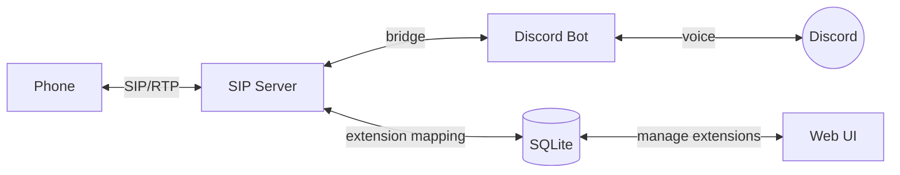
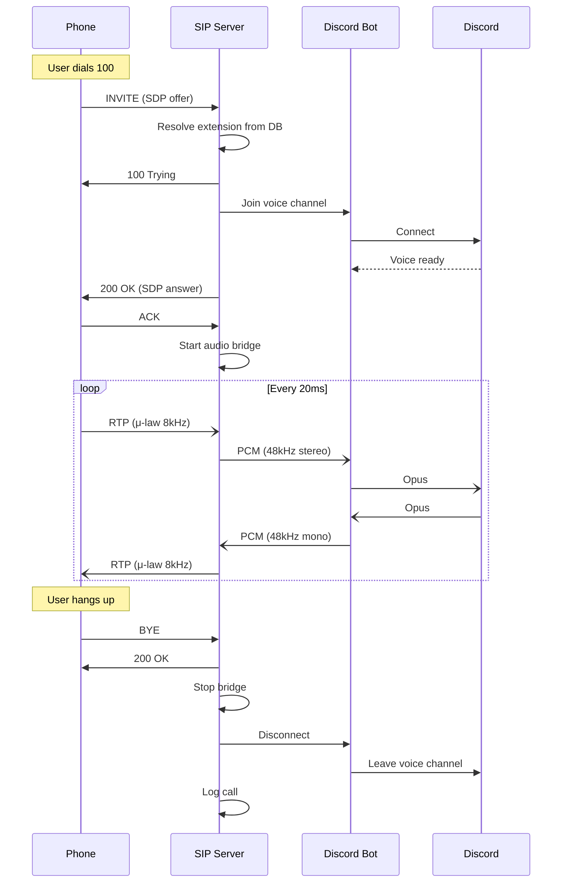
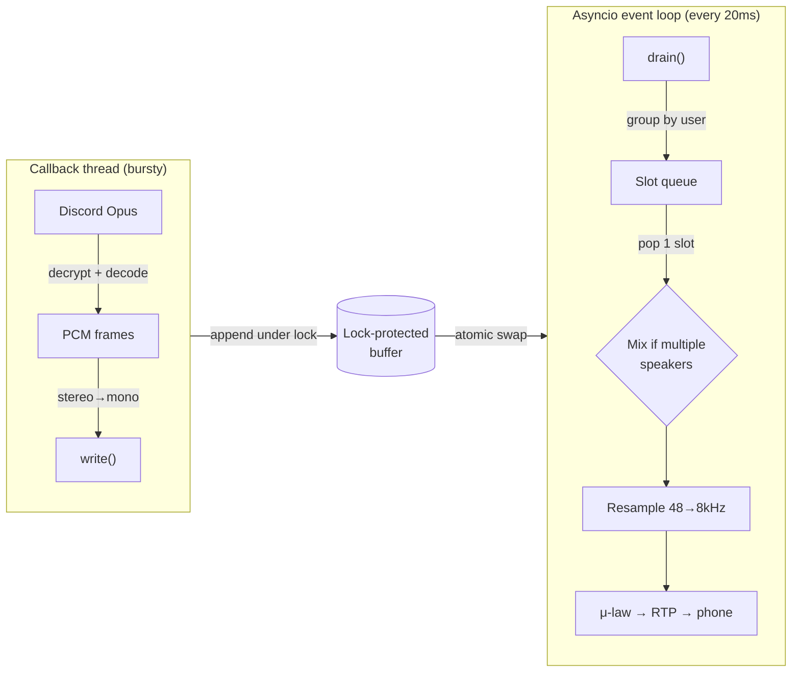

# Design

## Architecture

frizzle-phone bridges phone calls to Discord voice channels over SIP/RTP.



### SIP Server

[`sip/server.py`](src/frizzle_phone/sip/server.py): UDP server on port 5060. Handles INVITE/200 OK/ACK call setup, BYE teardown, and CANCEL. Manages per-call state machine (`ringing` → `active` → `completed`). Implements RFC 3261 transaction timers for reliable 2xx delivery.
- **Audio Bridge** ([`bridge.py`](src/frizzle_phone/bridge.py), [`bridge_manager.py`](src/frizzle_phone/bridge_manager.py)): Bidirectional real-time audio pipe between SIP/RTP and Discord voice. Strict 20ms packet cadence (both G.711 and Discord Opus use 20ms frames). Slot-based mixer handles receiving multiple simultaneous Discord speakers.
  - **p2d** (phone→Discord): decode G.711 μ-law, resample 8kHz→48kHz, stereo out to Discord
  - **d2p** (Discord→phone): mix speakers, resample 48kHz→8kHz, encode μ-law out to RTP
- **RTP** ([`rtp/`](src/frizzle_phone/rtp/)): Send/receive UDP media. PCMU (G.711 μ-law, payload type 0) at 8kHz. Includes codec implementation with precomputed lookup tables and `soxr` resampling.
- **Synth** ([`synth.py`](src/frizzle_phone/synth.py)): Procedural 8kHz audio generator. TR-808 drum synthesis + Reese bass for a techno loop, plus simple tone beeps. Pre-rendered at startup for audio extensions.

### Discord Bot

[`bot.py`](src/frizzle_phone/bot.py), [`phone_cog.py`](src/frizzle_phone/phone_cog.py): Minimal discord.py bot (guild + voice_states intents). PhoneCog watches `on_voice_state_update` to detect bot disconnects and sends BYE. Reconciliation loop (30s) catches orphaned calls after crashes.

### Web UI

[`web.py`](src/frizzle_phone/web.py): aiohttp server on port 8080. Single-page form to map extensions to Discord channels or audio files. No authentication; access is controlled at the network/reverse proxy level.

### Database

[`database.py`](src/frizzle_phone/database.py), [`migrations/`](migrations/): SQLite with aiosqlite. Stores extension mappings (discord and audio), call log, and enforces one active call per caller via partial unique index.

## Call Flow



## Discord→Phone Audio Pipeline

The d2p (Discord-to-Phone) path is the trickiest part of the bridge. Discord delivers decoded PCM frames on a **callback thread**, bursty, multi-speaker, and not aligned to RTP's strict 20ms cadence.



**Slot queue:** Discord delivers decoded PCM on a callback thread in bursts, not at a steady 20ms cadence. The slot queue buffers incoming frames and re-paces them to match RTP's strict 20ms timing.

```
Single speaker says "Hi it's frizzle" (6 frames, 20ms each).
Discord delivers them in two bursts instead of evenly:

  burst 1: [hi] [it] ['s]       burst 2: [fri] [zz] [le]

Each frame becomes one slot in the queue:

  queue: [hi] [it] ['s] ... [fri] [zz] [le]

RTP send loop pops one slot every 20ms:

  → [hi] → [it] → ['s] → [fri] → [zz] → [le]
    ├20ms┤  ├20ms┤  ├20ms┤  ├20ms┤  ├20ms┤

If the queue is empty when the send loop ticks, silence is sent.
```

With multiple speakers, frames from the same 20ms tick need to be mixed together. Each user only speaks once per tick, so seeing the same user again means a new tick started. That's how slot boundaries are detected.

```
A and B speaking, then B stops — seven frames arrive in one burst:

  buffer after drain:  [A] [B] [A] [B] [A] [A] [A]
                                ↑       ↑   ↑   ↑
                          each A repeat = new slot boundary

  slot 1: {A, B}  →  mix(A+B)   →  RTP
  slot 2: {A, B}  →  mix(A+B)   →  RTP
  slot 3: {A}     →  A directly  →  RTP
  slot 4: {A}     →  A directly  →  RTP
  slot 5: {A}     →  A directly  →  RTP
                                     ↑
                          popped one per 20ms tick
```

Queue caps at 50 slots (~1s); oldest dropped on overflow.

**Timing:** The `rtp_send_loop` runs on a strict 20ms wall-clock cadence using `time.monotonic()`. If the loop falls behind (e.g. event loop congestion), it snaps forward to avoid bursting catch-up packets. The resampler is reset after silence gaps to avoid filtering stale state.

**Mixing:** When a slot has multiple speakers, their mono samples are summed in int32 and clipped back to int16. Single-speaker slots skip the mix entirely.
