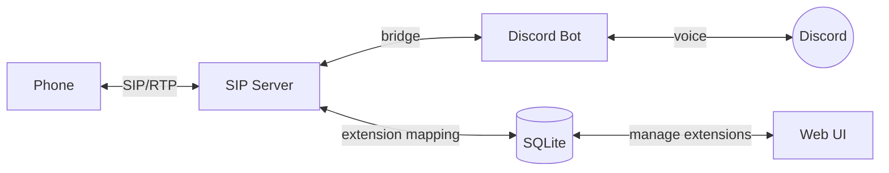
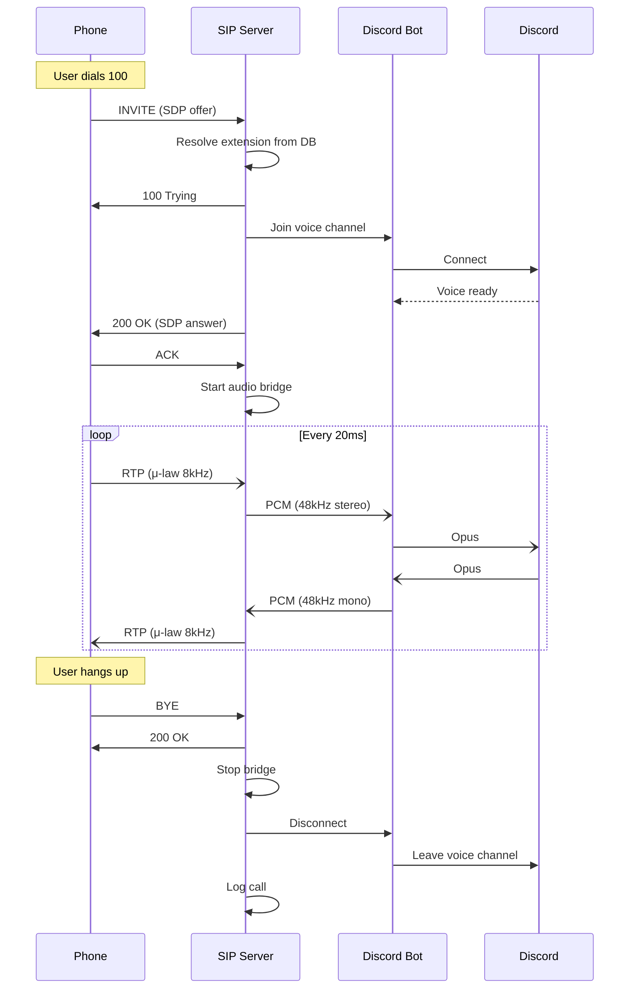
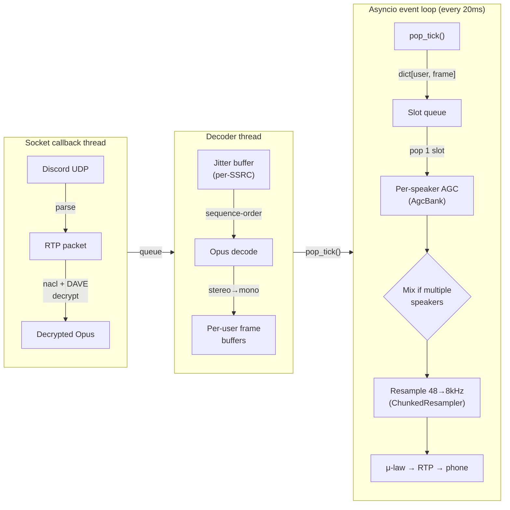

# Design

## Architecture

frizzle-phone bridges phone calls to Discord voice channels over SIP[^sip]/RTP[^rtp].



### SIP Server

[`sip/server.py`](src/frizzle_phone/sip/server.py): UDP[^udp] server on port 5060. Handles INVITE/200 OK/ACK call setup, BYE teardown, and CANCEL. Manages per-call state machine (`ringing` → `active` → `completed`). Implements RFC 3261[^rfc3261] transaction timers for reliable 2xx delivery.
- **Audio Bridge** ([`bridge.py`](src/frizzle_phone/bridge.py), [`bridge_manager.py`](src/frizzle_phone/bridge_manager.py)): Bidirectional real-time audio pipe between SIP/RTP and Discord voice. Strict 20ms packet cadence (both G.711[^g711] and Discord Opus[^opus] use 20ms frames). Slot-based mixer handles receiving multiple simultaneous Discord speakers.
  - **p2d** (phone→Discord): decode G.711 μ-law[^mulaw], resample 8kHz→48kHz, stereo out to Discord
  - **d2p** (Discord→phone): mix speakers, resample 48kHz→8kHz, encode μ-law out to RTP
- **RTP** ([`rtp/`](src/frizzle_phone/rtp/)): Send/receive UDP media. PCMU (G.711 μ-law, payload type 0) at 8kHz. Includes codec implementation with precomputed lookup tables and `soxr`[^soxr] resampling (`LQ` sinc[^sinc]-based quality — see [Resampling](#resampling) below).
- **Synth** ([`synth.py`](src/frizzle_phone/synth.py)): Procedural 8kHz audio generator. TR-808 drum synthesis + Reese bass for a techno loop, plus simple tone beeps. Pre-rendered at startup for audio extensions.

### Discord Bot

[`bot.py`](src/frizzle_phone/bot.py), [`phone_cog.py`](src/frizzle_phone/phone_cog.py): Minimal discord.py[^discordpy] bot (guild + voice_states intents). PhoneCog watches `on_voice_state_update` to detect bot disconnects and sends BYE. Reconciliation loop (30s) catches orphaned calls after crashes. Voice receive is handled by the in-house [`discord_voice_rx`](src/frizzle_phone/discord_voice_rx/) module, a `VoiceRecvClient` subclass of `discord.VoiceClient` that decrypts and decodes incoming Opus frames.

### Web UI

[`web.py`](src/frizzle_phone/web.py): aiohttp[^aiohttp] server on port 8080. Single-page form to map extensions to Discord channels or audio files. No authentication; access is controlled at the network/reverse proxy level.

### Database

[`database.py`](src/frizzle_phone/database.py), [`migrations/`](src/frizzle_phone/migrations/): SQLite[^sqlite] with aiosqlite[^aiosqlite]. Stores extension mappings (discord and audio), call log, and enforces one active call per caller via partial unique index.

## Call Flow



Diagram terms: SDP[^sdp]

## Discord→Phone Audio Pipeline

The d2p (Discord-to-Phone) path is the trickiest part of the bridge. Discord voice packets arrive on a **socket callback thread**, bursty, multi-speaker, and not aligned to RTP's strict 20ms cadence. The in-house `discord_voice_rx` module handles decryption and decoding in a pipeline that feeds the bridge via a lock-free `pop_tick()` pull interface.



Diagram terms: NaCl[^nacl], DAVE[^dave], jitter buffer[^jitter], SSRC[^ssrc], asyncio[^asyncio]

**Slot queue:** Each `pop_tick()` call returns a slot: a `dict[int, ndarray]` mapping user IDs to their mono PCM frame for that tick. The decoder thread groups frames by user internally, so each slot is already a complete multi-speaker snapshot. The slot queue buffers these and the RTP send loop pops one slot every 20ms.

```
Single speaker says "Hi it's frizzle" (6 frames, 20ms each).
Discord delivers them in two bursts instead of evenly:

  burst 1: [hi] [it] ['s]       burst 2: [fri] [zz] [le]

Each pop_tick() returns one slot:

  queue: [hi] [it] ['s] ... [fri] [zz] [le]

RTP send loop pops one slot every 20ms:

  → [hi] → [it] → ['s] → [fri] → [zz] → [le]
    ├20ms┤  ├20ms┤  ├20ms┤  ├20ms┤  ├20ms┤

If the queue is empty when the send loop ticks, silence is sent.
```

With multiple speakers, `pop_tick()` returns all active speakers in a single slot:

```
A and B speaking, then B stops:

  tick 1: pop_tick() → {A: frame, B: frame}  →  mix(A+B)    →  RTP
  tick 2: pop_tick() → {A: frame, B: frame}  →  mix(A+B)    →  RTP
  tick 3: pop_tick() → {A: frame}            →  A directly   →  RTP
  tick 4: pop_tick() → {A: frame}            →  A directly   →  RTP
  tick 5: pop_tick() → {A: frame}            →  A directly   →  RTP
                                                                 ↑
                                                    popped one per 20ms tick
```

Queue caps at 50 slots (~1s); oldest dropped on overflow.

**Timing:** The `rtp_send_loop` runs on a strict 20ms wall-clock cadence using `time.monotonic()`. If the loop falls behind (e.g. event loop congestion), it snaps forward to avoid bursting catch-up packets. The resampler is reset after silence gaps to avoid filtering stale state.

**AGC[^agc]:** Per-speaker automatic gain control (`AgcBank`) normalizes each speaker's level to -20 dBFS[^dbfs] before mixing. Uses RMS[^rms]-based gain with asymmetric time constants (500ms attack, 50ms release), a 500ms level estimation window, and a -50 dBFS noise gate[^noisegate]. Gain increases are held off for 120ms (6 frames) to prevent transient bursts from pumping gain up. Output uses a tanh soft limiter[^softlimiter] instead of hard clipping to avoid distortion near int16 boundaries. Gain is clamped to [-10, +20] dB. Stale speakers are expired after 30s of inactivity.

**Mixing:** When a slot has multiple speakers, their mono samples are summed in int32 with 1/sqrt(N) gain scaling and clipped back to int16. Single-speaker slots skip the mix entirely.

### Resampling

Both directions use `soxr.LQ` (sinc-based, ~96dB stopband[^stopband] rejection) via `ChunkedResampler`, a wrapper that accumulates soxr's bursty output and yields fixed-size chunks.

**Why `LQ`, not `QQ` or `HQ`:**
- `QQ` (cubic interpolation) has **no anti-aliasing filter[^antialiasing]**. The 6:1 decimation on the d2p path (48kHz→8kHz) folds spectral content above 4kHz back into the voice band as audible aliasing[^aliasing] artifacts — metallic harshness and reduced intelligibility.
- `LQ` uses a sinc-based FIR[^fir] filter with ~96dB stopband attenuation, more than sufficient for telephony (G.712[^g712] specifies the 0–3.4kHz passband). CPU cost is negligible for mono 8kHz voice.
- `HQ`/`VHQ` add 7+ frames (~140ms) of group delay[^groupdelay] before any output, which is too much for interactive voice. `LQ` primes in ~2-3 frames (~40-60ms).

**Why `ChunkedResampler`:** Sinc-based soxr modes (`LQ`+) buffer internally and emit samples in variable-size bursts rather than a steady 1:ratio output. `ChunkedResampler` accumulates resampler output and yields exactly the expected frame size (160 samples at 8kHz for d2p, 960 samples at 48kHz for p2d) so the rest of the pipeline sees a consistent chunk per feed.

[^agc]: AGC, [Automatic gain control](https://en.wikipedia.org/wiki/Automatic_gain_control) — normalizes audio levels per speaker
[^aiohttp]: [aiohttp](https://docs.aiohttp.org/en/stable/) — async HTTP server/client framework for Python
[^aiosqlite]: [aiosqlite](https://pypi.org/project/aiosqlite/) — async wrapper for Python's sqlite3
[^aliasing]: [Aliasing](https://en.wikipedia.org/wiki/Aliasing) — distortion from undersampled high-frequency content
[^antialiasing]: [Anti-aliasing filter](https://en.wikipedia.org/wiki/Anti-aliasing_filter) — removes frequencies above Nyquist before downsampling
[^asyncio]: [asyncio](https://docs.python.org/3/library/asyncio.html) — Python's async I/O framework
[^dave]: [DAVE](https://daveprotocol.com/) — Discord's end-to-end encryption protocol for voice
[^dbfs]: [dBFS](https://en.wikipedia.org/wiki/DBFS) — decibels relative to digital full scale
[^discordpy]: [discord.py](https://discordpy.readthedocs.io/en/stable/) — Python wrapper for the Discord API
[^fir]: FIR, [Finite impulse response](https://en.wikipedia.org/wiki/Finite_impulse_response) — filter type with fixed-length kernel
[^g711]: [G.711](https://en.wikipedia.org/wiki/G.711) — ITU-T standard for 8kHz logarithmic PCM audio
[^g712]: [G.712](https://www.itu.int/rec/T-REC-G.712-200111-I/en) — ITU-T spec for telephony passband (0–3.4kHz)
[^groupdelay]: [Group delay](https://en.wikipedia.org/wiki/Group_delay_and_phase_delay) — time delay introduced by a filter
[^jitter]: [Jitter buffer](https://en.wikipedia.org/wiki/Jitter#Jitter_buffers) — reorders and smooths bursty packet arrivals
[^mulaw]: [μ-law algorithm](https://en.wikipedia.org/wiki/%CE%9C-law_algorithm) — logarithmic companding for G.711
[^nacl]: [NaCl](https://nacl.cr.yp.to/) — networking and cryptography library for voice packet encryption
[^noisegate]: [Noise gate](https://en.wikipedia.org/wiki/Noise_gate) — silences signal below a threshold
[^opus]: [Opus](https://en.wikipedia.org/wiki/Opus_(audio_format)) — low-latency audio codec used by Discord
[^rfc3261]: [RFC 3261](https://datatracker.ietf.org/doc/html/rfc3261) — core SIP specification
[^rms]: RMS, [Root mean square](https://en.wikipedia.org/wiki/Root_mean_square) — measure of signal amplitude
[^rtp]: RTP, [Real-time Transport Protocol](https://en.wikipedia.org/wiki/Real-time_Transport_Protocol) — carries audio/video over UDP
[^sdp]: SDP, [Session Description Protocol](https://en.wikipedia.org/wiki/Session_Description_Protocol) — carries codec and transport parameters in INVITE/200 OK
[^sinc]: [Whittaker–Shannon interpolation](https://en.wikipedia.org/wiki/Whittaker%E2%80%93Shannon_interpolation_formula) — ideal reconstruction basis for resampling
[^sip]: SIP, [Session Initiation Protocol](https://en.wikipedia.org/wiki/Session_Initiation_Protocol) — signaling protocol for voice/video calls
[^softlimiter]: [Limiter](https://en.wikipedia.org/wiki/Limiter) — prevents clipping by compressing peaks
[^soxr]: [soxr](https://sourceforge.net/projects/soxr/) — high-quality sample rate conversion library
[^sqlite]: [SQLite](https://en.wikipedia.org/wiki/SQLite) — embedded relational database
[^ssrc]: SSRC, [Synchronization source](https://en.wikipedia.org/wiki/Real-time_Transport_Protocol#Packet_header) — identifier in the RTP header, one per speaker
[^stopband]: [Stopband](https://en.wikipedia.org/wiki/Stopband) — frequency range attenuated by a filter
[^udp]: UDP, [User Datagram Protocol](https://en.wikipedia.org/wiki/User_Datagram_Protocol) — connectionless transport protocol
