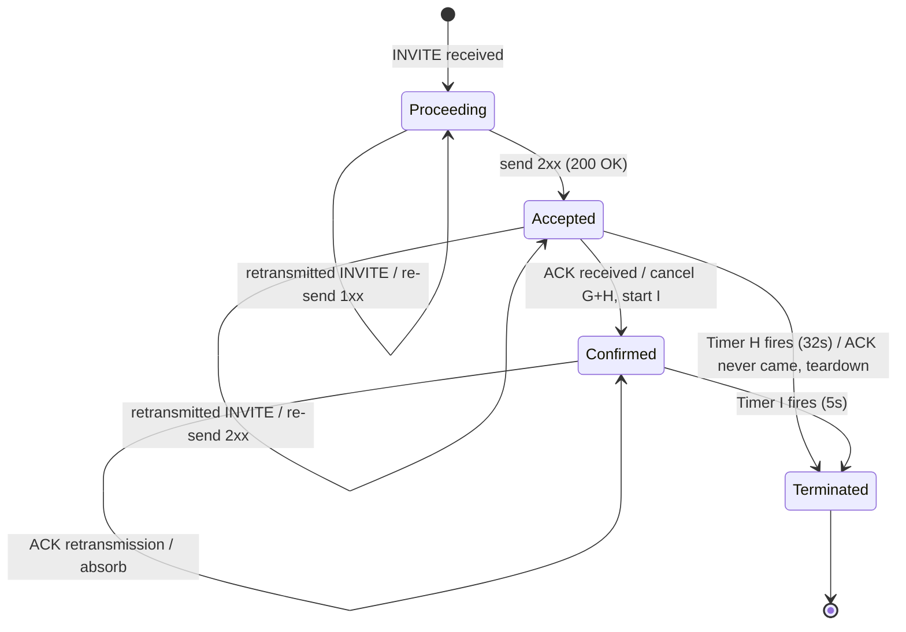
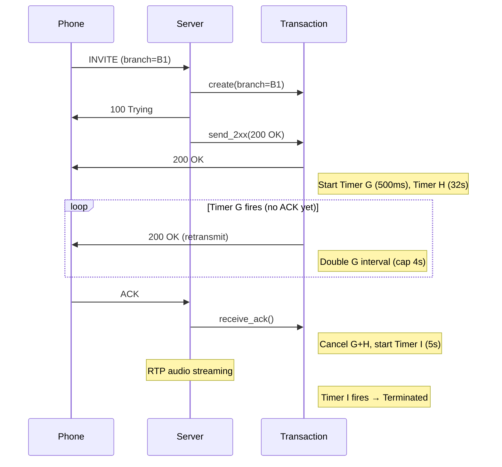

# SIP Transaction Layer

INVITE server transaction state machine per RFC 3261 §17.2.1 + RFC 6026.

## State Machine

## Timers

| Timer | Start | Default | Behavior |
|-------|-------|---------|----------|
| **G** | On 2xx sent | T1 = 500ms | Retransmit 2xx, double interval each firing (cap at T2 = 4s) |
| **H** | On 2xx sent | 64 × T1 = 32s | Max wait for ACK — terminate transaction, send BYE |
| **I** | On ACK received | T4 = 5s | Absorb ACK retransmissions, then clean up |

## Call Flow

## Files

| File | Purpose |
|------|---------|
| `transaction.py` | `InviteServerTxn` — state machine + timers G/H/I |
| `server.py` | `SipServer` — UDP protocol, call state, transaction integration |
| `message.py` | SIP message parsing (with compact header normalization) and response building |
| `sdp.py` | SDP offer parsing and answer generation |
